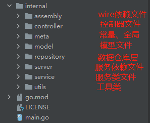
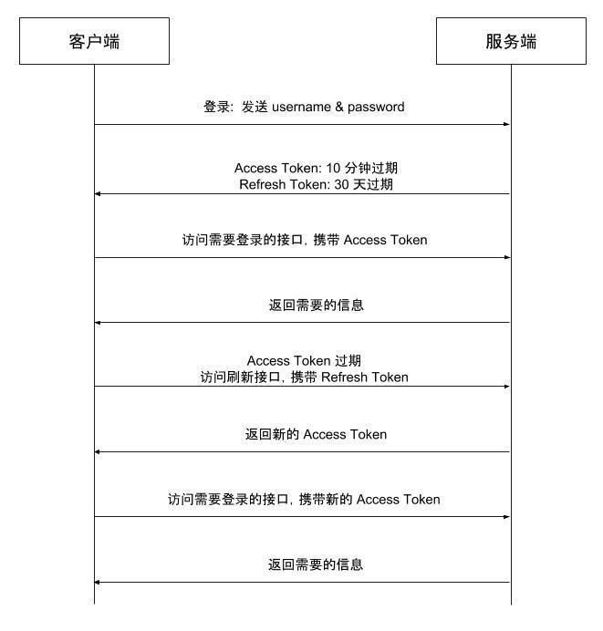

# go_example
## 简介
本项目为基础的web开发架构设计，主要采用gin框架，使用cobra生成应用和命令文件的脚手架，使用wire解决依赖注入问题，
最终实现一个高性能、可扩展、多应用的web框架。

## 功能
+ 连接MySQL单机及主从数据库；
+ 连接Redis单机及Cluster集群；
+ 使用JWT登录验证及单点登录；
+ Excel文件（.xlsx）导入导出；
+ 提供WebSocket服务；
+ 提供gRPC服务；

## 主要贡献
+ https://github.com/gin-gonic/gin
+ https://github.com/spf13/cobra
+ https://github.com/google/wire
+ https://github.com/spf13/viper
+ https://xorm.io/xorm
+ https://github.com/go-redis/redis
+ https://github.com/golang-jwt/jwt
+ https://github.com/qax-os/excelize
+ https://github.com/gorilla/websocket
+ https://google.golang.org/grpc

## 版本
+ 版本v1.0.0实现了cobra+gin框架的结合；
+ 版本v1.1.0增加了wire解决依赖注入及项目文件目录整体架构；
+ 版本v1.2.0增加了xorm连接Mysql数据库；
+ 版本v1.3.1实现了redis连接；
+ 版本v1.4.0接入JWT实现登录验证；
+ 版本v1.4.1增加JWT Refresh Token；
+ 版本v1.4.2升级JWT密钥；
+ 版本v1.4.3单点登录；
+ 版本v1.4.4单点登录，对代码依赖优化；
+ 版本v1.5.0增加xlsx文件导入导出；
+ 版本v1.6.0实现Gin优雅关机；
+ 版本v1.7.0实现WebSocket服务；
+ 版本v1.7.1实现WebSocket心跳检测及客户端来源检查；
+ 版本v1.8.0实现gRPC服务；
+ 版本v1.8.1增加gRPC使用服务端认证；
+ 版本v1.8.2增加gRPC使用客户端/服务端各自证书认证；

## 使用
要求golang版本必须支持Go Modules，建议版本在1.14以上。本系统使用1.17.9版本。

克隆到本地目录
```shell
git clone git@github.com:ken-house/go_example.git
```
加载相应的依赖包
```shell
go mod tidy
```
启动服务
```go
go run main.go http
```
访问：http://127.0.0.1:8080/hello


## 目录结构
```
go_example/
├── cmd
│   ├── http.go // http服务入口
│   └── root.go // 根命令
├── configs // 配置文件
│   ├── debug
│   │   └── common.yaml 
│   ├── dev
│   ├── prod
│   └── test
├── go.mod
├── go.sum
├── internal // 项目主体内容
│   ├── assembly // wire 定义依赖
│   │   ├── controller.go
│   │   ├── server.go
│   │   ├── service.go
│   │   └── wire_gen.go
│   ├── controller // 控制器文件
│   │   └── hello_controller.go
│   ├── meta // 定义常量、全局变量等
│   │   └── meta.go
│   ├── model // 模型类文件
│   ├── repository // 数据库等仓库文件
│   ├── server // 开启服务
│   │   └── http.go
│   ├── service // 程序服务类
│   │   └── hello_service.go
│   └── utils // 工具类
│       └── negotiate
│           └── negotiate.go
├── LICENSE
├── main.go
└── README.md
```
## 项目框架实现过程
### 新建项目
创建一个项目目录，例如：go_example，执行命令初始化go modules。
```shell
go mod init github.com/go_example
```
### 创建脚手架
安装cobra
```shell
cobra init ../go_example
```
创建web服务入口
```shell
cobra add http
```
### 引入Gin框架做web服务
在cmd/http.go文件中，创建Gin引擎，注册路由，运行服务。
```go
// httpCmd represents the http command
var httpCmd = &cobra.Command{
	Use:   "http",
	Short: "A brief description of your command",
	Long:  `http server`,
	Run: func(cmd *cobra.Command, args []string) {
		// 实例化依赖注入服务
		httpSrv, clean, err := assembly.NewHttpServer()
		if err != nil {
			log.Fatalf("%+v\n", err)
		}
		defer clean()

		// 设置gin的运行环境
		gin.SetMode(meta.EnvMode)

		// 初始化engine
		app := gin.Default()

		// 注册路由
		httpSrv.Register(app)

		// 运行应用
		port := viper.GetString("server.http.addr")
		if err := app.Run(port); err != nil {
			log.Fatalf("%+v\n", err)
		}
	},
}
```
在cmd/root.go文件中，通过cobra.OnInitialize(initConfig)对项目的配置进行初始化。
```go
func init() {
	// 初始化配置文件
	cobra.OnInitialize(initConfig)
	rootCmd.Flags().BoolP("toggle", "t", false, "Help message for toggle")
}

// 初始化配置文件
func initConfig() {
	// 从系统环境变量中读取运行环境
	meta.EnvMode = env.Mode()

	// viper目前仅支持单文件
	viper.SetConfigFile(meta.CfgFile + "/" + meta.EnvMode + "/common.yaml")

	if err := viper.ReadInConfig(); err != nil {
		if _, ok := err.(viper.ConfigFileNotFoundError); ok {
			fmt.Println("找不到配置文件..")
		} else {
			fmt.Println("配置文件出错..")
		}
		log.Fatal(err)
	}
}
```
此时，运行项目就可以启动web服务，访问127.0.0.1:8080/hello即可访问。
```shell
go run main.go http
```
### wire解决依赖注入
安装wire
```shell
go get -u github.com/google/wire
```
对项目目录结构进行分层，目录结构如下：



在项目中，web服务调用controller控制器，控制器调用service服务类，服务类调用repository数据仓库层，
数据仓库层调用其他包生成的服务引擎客户端（如mysql）。

这里以控制器调用服务类举例：
在controller目录下创建hello_controller.go文件。 
1. 采用面向接口编程，因此会有一个向外提供服务的interface类型的HelloController， 该接口规范了struct类型的接收者里的方法；
2. 在接收者helloController中定义要调用的服务service.HelloService；
3.  创建一个实例化当前控制器的方法，提供给上层调用；
```go
package controller

import (
	"net/http"

	"github.com/go_example/internal/utils/negotiate"

	"github.com/gin-gonic/gin"
	"github.com/go_example/internal/service"
)

type HelloController interface {
	Say(c *gin.Context) (int, gin.Negotiate)
}

type helloController struct {
	helloSvc service.HelloService
}

func NewHelloController(helloSvc service.HelloService) HelloController {
	return &helloController{
		helloSvc: helloSvc,
	}
}

func (ctr *helloController) Say(c *gin.Context) (int, gin.Negotiate) {
	data := ctr.helloSvc.SayHello(c)
	return negotiate.JSON(http.StatusOK, data)
}
```
在service目录下创建hello_service.go文件。同hello_controller.go文件类似定义。

```go
package service

import (
	"github.com/gin-gonic/gin"
	MysqlRepo "github.com/go_example/internal/repository/mysql"
	"github.com/spf13/viper"
)

type HelloService interface {
	SayHello(c *gin.Context) map[string]string
}

type helloService struct {
	UserRepo MysqlRepo.UserRepository
}

func NewHelloService(userRepo MysqlRepo.UserRepository) HelloService {
	return &helloService{
		UserRepo: userRepo,
	}
}

func (svc *helloService) SayHello(c *gin.Context) map[string]string {
	user, _ := svc.UserRepo.GetUserInfo(1)
	return map[string]string{
		"hello": "world，golang",
		"env":   viper.GetString("server.mode"),
		"user":  user.Name,
	}
}
```
assembly目录下创建wire文件，这里命名为controller.go，定义了控制器的依赖关系。
必须在文件第一行加上// +build wireinject表示不参与编译。
```go
//go:build wireinject
// +build wireinject

package assembly

import (
	"github.com/go_example/internal/controller"
	"github.com/google/wire"
)

func NewHelloController() (controller.HelloController, func(), error) {
	panic(wire.Build(
		NewHelloService,
		controller.NewHelloController,
	))
}
```
同样创建一个服务类的service.go文件，定义服务类的依赖关系。
```go
//go:build wireinject

package assembly

import (
	MysqlRepo "github.com/go_example/internal/repository/mysql"
	"github.com/go_example/internal/service"
	"github.com/google/wire"
)

func NewHelloService() (service.HelloService, func(), error) {
	panic(wire.Build(
		NewMysqlGroupClient,
		MysqlRepo.NewUserRepository,
		service.NewHelloService,
	))
}
```
进入assembly目录下，执行wire命令生成wire_gen.go文件。
```shell
cd ./internal/assembly
wire
```
这样就解决了文件互相依赖的问题，每层更加专注实现自己的功能，不用关心依赖方的实现。

## 连接MySQL
### 安装
```shell
go get -u github.com/go-sql-driver/mysql
go get -u xorm.io/xorm
```
### 代码解析
在assembly目录下，创建一个common.go文件，该文件定义了获取MySQL连接，并遵循wire规范。
```go
// NewMysqlSingleClient 单机数据库连接
func NewMysqlSingleClient() (meta.MysqlSingleClient, func(), error) {
	var cfg mysqlClient.SingleConfig
	if err := viper.Sub("mysql." + meta.MysqlSingleDriverKey).Unmarshal(&cfg); err != nil {
		return nil, nil, err
	}
	return mysqlClient.NewSingleClient(cfg)
}

// NewMysqlGroupClient 主从数据库连接
func NewMysqlGroupClient() (meta.MysqlGroupClient, func(), error) {
	var cfg mysqlClient.GroupConfig
	if err := viper.Sub("mysql." + meta.MysqlGroupDriverKey).Unmarshal(&cfg); err != nil {
		return nil, nil, err
	}
	cfg.IsDebug = !env.IsReleasing()
	return mysqlClient.NewGroupClient(cfg)
}
```
以单机数据库连接为例，定义了SingleClient接口，singleClient结构体为接收者，NewSingleClient用来返回一个客户端连接及wire所需要的回调方法和错误。

在获取数据库连接中，使用了xorm创建数据库连接。
```go
package mysqlClient

import (
	"time"

	"github.com/go-sql-driver/mysql"
	"github.com/pkg/errors"
	"xorm.io/xorm"
)

//SingleClient 单实例客户端
type SingleClient interface {
	xorm.EngineInterface
	Transaction(f func(*xorm.Session) (interface{}, error)) (interface{}, error)
	GetEngine() *xorm.Engine
}

type singleClient struct {
	*xorm.Engine
}

func NewSingleClient(cfg SingleConfig) (SingleClient, func(), error) {
	engine, err := newEngine(cfg)
	if err != nil {
		return nil, nil, err
	}
	client := &singleClient{Engine: engine}
	return client, func() {
		_ = client.Close()
	}, nil
}

func (cli *singleClient) GetEngine() *xorm.Engine {
	return cli.Engine
}

func (cli *singleClient) Transaction(f func(*xorm.Session) (interface{}, error)) (interface{}, error) {
	return cli.Engine.Transaction(f)
}

type SingleConfig struct {
	MaxIdle     int    `json:"max_idle" mapstructure:"max_idle"`
	MaxOpen     int    `json:"max_open" mapstructure:"max_open"`
	MaxLifetime int    `json:"max_lifetime" mapstructure:"max_lifetime"`
	Dsn         string `json:"dsn" mapstructure:"dsn"`
	IsDebug     bool   `json:"is_debug" mapstructure:"is_debug"`
}

func newEngine(cfg SingleConfig) (*xorm.Engine, error) {
	engine, err := xorm.NewEngine("mysql", cfg.Dsn)
	if err != nil {
		return nil, errors.WithStack(err)
	}
	if err := engine.Ping(); err != nil {
		return nil, errors.WithStack(err)
	}
	if cfg.IsDebug {
		engine.ShowSQL(true)
	}
	if cfg.MaxIdle > 0 {
		engine.SetMaxIdleConns(cfg.MaxIdle)
	}
	if cfg.MaxOpen > 0 {
		engine.SetMaxOpenConns(cfg.MaxOpen)
	}
	if cfg.MaxLifetime > 0 {
		engine.SetConnMaxLifetime(time.Duration(cfg.MaxLifetime) * time.Second)
	}
	dsnCfg, _ := mysql.ParseDSN(cfg.Dsn)
	dsnCfg.Passwd = ""
	return engine, nil
}

```
最后，将NewMysqlSingleClient或NewMysqlGroupClient方法注入到Repository中，修改assembly/service.go文件如下：
```go
//go:build wireinject

package assembly

import (
	MysqlRepo "github.com/go_example/internal/repository/mysql"
	RedisRepo "github.com/go_example/internal/repository/redis"
	"github.com/go_example/internal/service"
	"github.com/google/wire"
)

func NewHelloService() (service.HelloService, func(), error) {
	panic(wire.Build(
		NewRedisGroupClient,
		RedisRepo.NewUserRepository,
		NewMysqlGroupClient,
		MysqlRepo.NewUserRepository,
		service.NewHelloService,
	))
}
```
这样在数据仓库层（repository）就可以使用数据库连接了。

## 连接Redis
### 安装
```shell
go get -u github.com/go-redis/redis/v8
```
### 代码解析
Redis连接同MySQL类似，目的也是提供一个Redis连接，注入到repository中。
在assembly/common.go文件中定义两个方法分别为连接单机和redisCluster集群模式；
```go
// NewRedisSingleClient 连接Redis单机
func NewRedisSingleClient() (meta.RedisSingleClient, func(), error) {
	var cfg redisClient.SingleConfig
	if err := viper.Sub("redis." + meta.RedisSingleDriverKey).Unmarshal(&cfg); err != nil {
		return nil, nil, err
	}
	return redisClient.NewSingleClient(cfg)
}

// NewRedisGroupClient 连接RedisCluster集群
func NewRedisGroupClient() (meta.RedisGroupClient, func(), error) {
	var cfg redisClient.GroupConfig
	if err := viper.Sub("redis." + meta.RedisGroupDriverKey).Unmarshal(&cfg); err != nil {
		return nil, nil, err
	}
	return redisClient.NewGroupClient(cfg)
}
```
以单机连接为例，定义了SingleClient接口，singleClient结构体为接收者，NewSingleClient返回redis连接及回调方法和错误

获取redis连接使用了github.com/go-redis/redis/v8包，代码如下：
```go
package redisClient

import (
	"context"

	"github.com/pkg/errors"

	"github.com/go-redis/redis/v8"
)

type SingleClient interface {
	redis.UniversalClient
}

type singleClient struct {
	redis.UniversalClient
}

func NewSingleClient(cfg SingleConfig) (SingleClient, func(), error) {
	client, err := NewClient(cfg)
	if err != nil {
		return nil, nil, err
	}
	sc := &singleClient{UniversalClient: client}
	return sc, func() {
		client.Close()
	}, nil
}

type SingleConfig struct {
	Addr     string `json:"addr" mapstructure:"addr"`
	Password string `json:"password" mapstructure:"password"`
	DB       int    `json:"db" mapstructure:"db"`
}

func NewClient(cfg SingleConfig) (*redis.Client, error) {
	client := redis.NewClient(&redis.Options{
		Addr:     cfg.Addr,
		Password: cfg.Password,
		DB:       cfg.DB,
	})
	_, err := client.Ping(context.Background()).Result()
	if err != nil {
		return nil, errors.WithStack(err)
	}
	return client, err
}
```
最后，将NewRedisSingleClient和NewRedisGroupClient方法注入到Repository中，修改assembly/service.go文件如下：
```go
//go:build wireinject

package assembly

import (
	MysqlRepo "github.com/go_example/internal/repository/mysql"
	RedisRepo "github.com/go_example/internal/repository/redis"
	"github.com/go_example/internal/service"
	"github.com/google/wire"
)

func NewHelloService() (service.HelloService, func(), error) {
	panic(wire.Build(
		NewRedisGroupClient,
		RedisRepo.NewUserRepository,
		NewMysqlGroupClient,
		MysqlRepo.NewUserRepository,
		service.NewHelloService,
	))
}
```
这样在数据仓库层（repository）就可以使用Redis连接了。

## JWT登录验证
JWT的出现就是为了解决传统Session+Cookie技术存在的各种问题，随着前后端分离的发展，JWT被广泛使用。
### 普通验证
#### 生成JWT
注册两个路由，分别为登录和首页，其中首页需要登录用户才可以访问，修改internal/server/http.go文件，代码如下：
```go
func (srv *httpServer) Register(router *gin.Engine) {
	router.GET("/hello", srv.Hello())
	// 登录接口
	router.POST("/login", srv.Login())
	// 用户主页
	router.GET("/home", middleware.JWTAuthMiddleware(), srv.Home())
}
```
当请求127.0.0.1:8080/login进行登录，系统根据提交的表单数据验证用户密码后生成JWT，
```go
func (svc *loginService) Login(formData model.LoginForm) (token string, err error) {
	// 验证用户登录
	userInfo, err := svc.UserRepo.FindIdentity(formData)
	if err != nil {
		return "", errors.New("用户名密码不正确")
	}

	// 登录成功则生成Token
	return auth.GenToken(userInfo)
}
```
接下来，golang如何生成jwt的，需要先安装：
```shell
go get -u github.com/golang-jwt/jwt/v4
```
+ 新建common/auth/auth.go文件，因为我们要自定义参数，所以定义一个CustomClaims结构体，其中包含用户信息；
+ 定义一个token的过期时间及加密盐；
+ 定义生成token的方法，使用jwt.SigningMethodHS256加密方式生成签名对象，然后通过加密盐进行加密并返回json字符串;
```go
type CustomClaims struct {
	UserInfo MysqlModel.User `json:"user_info"`
	jwt.RegisteredClaims
}

const TokenExpireDuration = time.Hour * 24

// CustomSecret 用于加盐的字符串
var CustomSecret = []byte("custom_salt")

// GenToken 生成token
func GenToken(userInfo MysqlModel.User) (string, error) {
	claims := CustomClaims{
		userInfo,
		jwt.RegisteredClaims{
			Issuer:    "ken",
			ExpiresAt: jwt.NewNumericDate(time.Now().Add(TokenExpireDuration)),
		},
	}

	// 使用指定的签名方法创建签名对象
	token := jwt.NewWithClaims(jwt.SigningMethodHS256, claims)

	// 使用指定的secret签名并获得完整的编码后的字符串token
	return token.SignedString(CustomSecret)
}
```
至此，登陆成功后会返回一个json字符串，我们称为token(令牌)。
#### 解析JWT
gin框架支持中间价，在访问主页的路由上使用中间价，即可完成验证；
```go
router.GET("/home", middleware.JWTAuthMiddleware(), srv.Home())
```
创建internal/middleware/jwt_auth_middlerware.go文件，接收请求头里的AUTHORIZATION进行解析JWT，解析成功将JWT中的UserInfo信息写入到gin.context中；
```go
func JWTAuthMiddleware() func(c *gin.Context) {
	return func(c *gin.Context) {
		authorization := c.Request.Header.Get("Authorization")
		if authorization == "" {
			c.JSON(http.StatusOK, gin.H{
				"message": "request header authorization is empty",
			})
			c.Abort()
			return
		}

		parts := strings.SplitN(authorization, " ", 2)
		if !(len(parts) == 2 && parts[0] == "Bearer") {
			c.JSON(http.StatusOK, gin.H{
				"message": "request header authorization is invalid",
			})
			c.Abort()
			return
		}

		claims, err := auth.ParseToken(parts[1])
		if err != nil {
			c.JSON(http.StatusOK, gin.H{
				"message": "request header authorization parse token err",
			})
			c.Abort()
			return
		}

		c.Set("userInfo", claims.UserInfo)
		c.Next()
	}
}
```
接下来，就是对token进行解析，可以在common/auth/auth.go文件中看到，将token使用加密盐解析，最终得到CustomClaims；
```go
// ParseToken 解析token
func ParseToken(tokenString string) (*CustomClaims, error) {
	// 解析token
	token, err := jwt.ParseWithClaims(tokenString, &CustomClaims{}, func(token *jwt.Token) (interface{}, error) {
		return CustomSecret, nil
	})

	if err != nil {
		return nil, err
	}

	if claims, ok := token.Claims.(*CustomClaims); ok && token.Valid {
		return claims, nil
	}

	return nil, errors.New("token invalid")
}
```
至此，中间件若成功解析并写入到gin的上下文后，会进入到srv.Home()的业务逻辑中。
这样就实现了普通的JWT登录验证。

### JWT续期（Refresh Token）
JWT是一次签发带有过期时间的令牌Token，当登录成功后，系统会签发一个token，过期时间假设为30分钟，若用户登录成功后在30分钟后操作，解析JWT将会失效，那么就无法进入主页。
为了解决这个问题，可以采用refresh token的方式。

在请求接口中，我们使用的token称为access_token，该token带有用户信息；当access_token过期后，我们使用refresh_token重新获取新的access_token,
具体流程如下：
+ 客户端使用用户名密码进行认证
+ 服务端生成有效时间较短的 Access Token（例如 10 分钟），和有效时间较长的 Refresh Token（例如 7 天）
+ 客户端访问需要认证的接口时，携带 Access Token
+ 如果 Access Token 没有过期，服务端鉴权后返回给客户端需要的数据
+ 如果携带 Access Token 访问需要认证的接口时鉴权失败（例如返回 401 错误），则客户端使用 Refresh Token 向刷新接口申请新的 Access Token
+ 如果 Refresh Token 没有过期，服务端向客户端下发新的 Access Token
+ 客户端使用新的 Access Token 访问需要认证的接口



对普通验证代码进行改造，生成token时，返回一个access_token和refresh_token，解析token时使用对应的解密盐；
```go
package auth

import (
	"time"

	"github.com/pkg/errors"

	MysqlModel "github.com/go_example/internal/model/mysql"
	"github.com/golang-jwt/jwt/v4"
)

type CustomClaims struct {
	UserInfo MysqlModel.User `json:"user_info"`
	jwt.RegisteredClaims
}

const bearerSchema = "Bearer "
const accessTokenExpire = time.Minute * 30
const refreshTokenExpire = time.Hour * 24 * 30

// accessTokenSecret 用于加盐的字符串
var accessTokenSecret = []byte("custom_access_salt")

// refreshTokenSecret 用于加盐的字符串
var refreshTokenSecret = []byte("custom_refresh_salt")

// GenToken 生成token
func GenToken(userInfo MysqlModel.User) (string, string, error) {
	// 生成access_token
	accessClaims := CustomClaims{
		userInfo,
		jwt.RegisteredClaims{
			Issuer:    "ken",
			ExpiresAt: jwt.NewNumericDate(time.Now().Add(accessTokenExpire)),
		},
	}

	// 使用指定的签名方法创建签名对象
	accessToken := jwt.NewWithClaims(jwt.SigningMethodHS256, accessClaims)
	// 使用指定的secret签名并获得完整的编码后的字符串token
	accessTokenSign, err := accessToken.SignedString(accessTokenSecret)
	if err != nil {
		return "", "", err
	}

	// 生成refresh_token，不包含自定义信息
	refreshClaims := CustomClaims{
		MysqlModel.User{
			Id: userInfo.Id,
		},
		jwt.RegisteredClaims{
			Issuer:    "ken",
			ExpiresAt: jwt.NewNumericDate(time.Now().Add(refreshTokenExpire)),
		},
	}
	refreshToken := jwt.NewWithClaims(jwt.SigningMethodHS256, refreshClaims)
	refreshTokenSign, err := refreshToken.SignedString(refreshTokenSecret)
	if err != nil {
		return "", "", err
	}

	return bearerSchema + accessTokenSign, bearerSchema + refreshTokenSign, nil
}

// ParseToken 解析token
func ParseToken(tokenString string, grantType string) (*CustomClaims, error) {
	// 解析token
	token, err := jwt.ParseWithClaims(tokenString, &CustomClaims{}, func(token *jwt.Token) (interface{}, error) {
		secret := accessTokenSecret
		if grantType == "refresh_token" {
			secret = refreshTokenSecret
		}
		return secret, nil
	})

	if err != nil {
		return nil, err
	}

	if claims, ok := token.Claims.(*CustomClaims); ok && token.Valid {
		return claims, nil
	}

	return nil, errors.New("token invalid")
}
```
注册一个/auth/refresh_token路由，用于刷新token；
```go
func (srv *httpServer) Register(router *gin.Engine) {
	router.GET("/hello", srv.Hello())
	// 登录接口
	router.POST("/auth/login", srv.Login())
	// 刷新token接口
	router.GET("/auth/refresh_token", srv.RefreshToken())
	// 用户主页
	router.GET("/home", middleware.JWTAuthMiddleware(), srv.Home())
}
```
RefreshToken方法，从头信息AUTHORIZATION中读取refresh_token，若解析refresh_token成功，可以得到用户id,查询用户信息，生成新的access_token及refresh_token,客户端后期使用新的access_token进行请求；
```go
func (ctr *authController) RefreshToken(c *gin.Context) (int, gin.Negotiate) {
	authorization := c.Request.Header.Get("Authorization")
	if authorization == "" {
		return negotiate.JSON(http.StatusOK, gin.H{"message": "令牌为空"})
	}

	parts := strings.SplitN(authorization, " ", 2)
	if !(len(parts) == 2 && parts[0] == "Bearer") {
		return negotiate.JSON(http.StatusOK, gin.H{"message": "令牌格式错误"})
	}

	claims, err := auth.ParseToken(parts[1], "refresh_token")
	if err != nil {
		return negotiate.JSON(http.StatusOK, gin.H{"message": "刷新令牌失败，请重新登录"})
	}

	// 重新生成令牌
	userInfo, err := ctr.authSvc.GetUserInfo(claims.UserInfo.Id)
	if err != nil {
		return negotiate.JSON(http.StatusOK, gin.H{"message": "用户信息错误，请重新登录"})
	}
	accessToken, refreshToken, err := auth.GenToken(userInfo)
	if err != nil {
		return negotiate.JSON(http.StatusOK, gin.H{"message": "生成令牌失败，请重新登录"})
	}

	return negotiate.JSON(http.StatusOK, gin.H{
		"data": gin.H{
			"accessToken":  accessToken,
			"refreshToken": refreshToken,
			"message":      "OK",
		},
	})
}
```
经过Refresh Token机制处理，实现了JWT的续期。

### 密钥对加密
前面对token加密都是通过自定义的密码盐进行加密，安全级别较低，使用密钥对加密token，更加安全可靠！
创建assets/certs/1652421664目录，执行下面命令，生成密钥对：
```shell
# 生成私钥
openssl genrsa -out rsa_private_key.pem 1024
# 生成公钥
openssl rsa -in rsa_private_key.pem -pubout -out rsa_public_key.pem
```
在配置文件中定义密钥列表及当前使用的key
```yaml
certs:
  curKey: 1652421664
  keys: [1652421664]
```
定义SetCerts()方法读取证书内容到全局变量certs中，该方法将在cmd/http.go文件中的RUN方法调用。
```go
type cert struct {
	PrivateKey []byte
	PublicKey  []byte
}

// 证书密钥
var certs = make(map[string]cert)

// 当前使用的证书key
var curKey string

// SetCerts 生成密钥
func SetCerts() {
	var certKeyConfig struct {
		CurKey string
		Keys   []string
	}
	err := viper.Sub("certs").Unmarshal(&certKeyConfig)
	if err != nil {
		panic(err)
	}

	for _, key := range certKeyConfig.Keys {
		privateKey, err := ioutil.ReadFile("assets/certs/" + key + "/rsa_private_key.pem")
		if err != nil {
			panic(err)
		}
		publicKey, err := ioutil.ReadFile("assets/certs/" + key + "/rsa_public_key.pem")
		if err != nil {
			panic(err)
		}
		cert := cert{
			PrivateKey: privateKey,
			PublicKey:  publicKey,
		}
		certs[key] = cert
	}

	// 读取当前的使用的证书key
	curKey = viper.GetString("certs.curKey")
}
```
接下来只需要将之前使用的密码盐加密替换成从pem文件中读取密钥对进行加解密，注意这里jwt.SigningMethodRS512加密类型，必须和生成密钥对的类型一致。
```go
// GenToken 生成token
func GenToken(userInfo MysqlModel.User) (string, string, error) {
	// 读取当前使用的私钥证书
	secret, err := jwt.ParseRSAPrivateKeyFromPEM(certs[curKey].PrivateKey)
	if err != nil {
		panic(err)
	}
	// 生成access_token
	accessClaims := CustomClaims{
		userInfo,
		jwt.RegisteredClaims{
			Issuer:    "ken",
			ExpiresAt: jwt.NewNumericDate(time.Now().Add(accessTokenExpire)),
		},
	}

	// 使用指定的签名方法创建签名对象
	accessToken := jwt.NewWithClaims(jwt.SigningMethodRS512, accessClaims)

	// 使用指定的secret签名并获得完整的编码后的字符串token
	accessTokenSign, err := accessToken.SignedString(secret)
	if err != nil {
		fmt.Println(err)
		return "", "", err
	}

	// 生成refresh_token，不包含自定义信息
	refreshClaims := CustomClaims{
		MysqlModel.User{
			Id: userInfo.Id,
		},
		jwt.RegisteredClaims{
			Issuer:    "ken",
			ExpiresAt: jwt.NewNumericDate(time.Now().Add(refreshTokenExpire)),
		},
	}
	refreshToken := jwt.NewWithClaims(jwt.SigningMethodRS512, refreshClaims)
	refreshTokenSign, err := refreshToken.SignedString(secret)
	if err != nil {
		return "", "", err
	}

	return bearerSchema + accessTokenSign, bearerSchema + refreshTokenSign, nil
}

// ParseToken 解析token
func ParseToken(tokenString string) (*CustomClaims, error) {
	// 解析token
	token, err := jwt.ParseWithClaims(tokenString, &CustomClaims{}, func(token *jwt.Token) (interface{}, error) {
		// 读取当前使用的公钥证书
		secret, err := jwt.ParseRSAPublicKeyFromPEM(certs[curKey].PublicKey)
		if err != nil {
			panic(err)
		}
		return secret, nil
	})

	if err != nil {
		return nil, err
	}

	if claims, ok := token.Claims.(*CustomClaims); ok && token.Valid {
		return claims, nil
	}

	return nil, errors.New("token invalid")
}
```

### 单点登录
由于JWT令牌是一次签发，在有效时间内一直有效，因此在多个设备登录后，本地的token是有效的，为了保证单点登录，可通过Redis记录用户最新一次的token信息。
生成或重新刷新token会将redis hash数据更新，解析token时，会检查token是否为用户的最新token信息。

在jwt.go文件中的GenToken()方法中增加保存到redis的操作：
```go
// 将token写入redis hash中
err = saveAuthTokenRedis(userInfo.Id, accessTokenSign, refreshTokenSign)
if err != nil {
    return "", "", err
}
```
在ParseToken()方法中获取redis的认证token，并和当前使用的token判断；
```go
if claims, ok := token.Claims.(*CustomClaims); ok && token.Valid {
    // 判断token是否有效，若无效返回错误
    err = checkAuthTokenRedis(claims.UserInfo.Id, tokenString, grantType)
    if err != nil {
        return nil, err
    }
    return claims, nil
}
```
### 单点登录优化（代码依赖）
在v1.4.3版本中，单独创建了driver/目录，实现redis连接，这样就存在两套Redis连接（通过wire注入形式的连接和driver自己编写的连接），为了优化该问题，避免循环调用，
对代码进行了以下调整：
1. 在httpServer注入一个authService，并在中间件中传入该服务类；
```go
type httpServer struct {
	helloCtr    controller.HelloController
	loginCtr    controller.AuthController
	homeCtr     controller.HomeController
	authService service.AuthService
}

func NewHttpServer(
	helloCtr controller.HelloController,
	loginCtr controller.AuthController,
	homeCtr controller.HomeController,
	authService service.AuthService,
) HttpServer {
	return &httpServer{
		helloCtr:    helloCtr,
		loginCtr:    loginCtr,
		homeCtr:     homeCtr,
		authService: authService,
	}
}

func (srv *httpServer) Register(router *gin.Engine) {
    router.GET("/hello", srv.Hello())
    // 登录接口
    router.POST("/auth/login", srv.Login())
    // 刷新token接口
    router.GET("/auth/refresh_token", srv.RefreshToken())
    // 用户主页
    router.GET("/home", middleware.JWTAuthMiddleware(srv.authService), srv.Home())
}
```
2. 中间件将authService服务类传入到auth.ParseToken方法中；
```go
func JWTAuthMiddleware(authService service.AuthService) func(c *gin.Context) {
	return func(c *gin.Context) {
		authorization := c.Request.Header.Get("Authorization")
		if authorization == "" {
			c.JSON(http.StatusOK, gin.H{
				"message": "令牌为空",
			})
			c.Abort()
			return
		}

		parts := strings.SplitN(authorization, " ", 2)
		if !(len(parts) == 2 && parts[0] == "Bearer") {
			c.JSON(http.StatusOK, gin.H{
				"message": "令牌格式错误",
			})
			c.Abort()
			return
		}

		claims, err := auth.ParseToken(authService, parts[1], "access_token")
		if err != nil {
			if err.Error() == "账号已在其他设备登录" {
				c.JSON(http.StatusOK, gin.H{
					"message": "账号已在其他设备登录",
				})
			} else {
				c.JSON(http.StatusOK, gin.H{
					"message":     "当前登录已失效，请尝试请求refresh_token获取新令牌",
					"refresh_url": "/auth/refresh_token",
				})
			}
			c.Abort()
			return
		}

		c.Set("userInfo", claims.UserInfo)
		c.Next()
	}
}
```
3. 在auth/jwt.go文件中，便可以使用authService下的验证令牌方法及生成令牌方法；
```go
// GenToken 生成token
func GenToken(authService service.AuthService, userInfo MysqlModel.User) (string, string, error) {
	// 读取当前使用的私钥证书
	secret, err := jwt.ParseRSAPrivateKeyFromPEM(certs[curKey].PrivateKey)
	if err != nil {
		panic(err)
	}
	// 生成access_token
	accessClaims := CustomClaims{
		userInfo,
		jwt.RegisteredClaims{
			Issuer:    "ken",
			ExpiresAt: jwt.NewNumericDate(time.Now().Add(accessTokenExpire)),
		},
	}

	// 使用指定的签名方法创建签名对象
	accessToken := jwt.NewWithClaims(jwt.SigningMethodRS512, accessClaims)

	// 使用指定的secret签名并获得完整的编码后的字符串token
	accessTokenSign, err := accessToken.SignedString(secret)
	if err != nil {
		return "", "", err
	}

	// 生成refresh_token，不包含自定义信息
	refreshClaims := CustomClaims{
		MysqlModel.User{
			Id: userInfo.Id,
		},
		jwt.RegisteredClaims{
			Issuer:    "ken",
			ExpiresAt: jwt.NewNumericDate(time.Now().Add(refreshTokenExpire)),
		},
	}
	refreshToken := jwt.NewWithClaims(jwt.SigningMethodRS512, refreshClaims)
	refreshTokenSign, err := refreshToken.SignedString(secret)
	if err != nil {
		return "", "", err
	}

	// 将token写入redis hash中
	err = authService.SaveAuthTokenRedis(userInfo.Id, accessTokenSign, refreshTokenSign)
	if err != nil {
		return "", "", err
	}

	return bearerSchema + accessTokenSign, bearerSchema + refreshTokenSign, nil
}

// ParseToken 解析token
func ParseToken(authService service.AuthService, tokenString string, grantType string) (*CustomClaims, error) {
	// 解析token
	token, err := jwt.ParseWithClaims(tokenString, &CustomClaims{}, func(token *jwt.Token) (interface{}, error) {
		// 读取当前使用的公钥证书
		secret, err := jwt.ParseRSAPublicKeyFromPEM(certs[curKey].PublicKey)
		if err != nil {
			panic(err)
		}
		return secret, nil
	})

	if err != nil {
		return nil, err
	}

	if claims, ok := token.Claims.(*CustomClaims); ok && token.Valid {
		// 判断token是否有效，若无效返回错误
		err = authService.CheckAuthTokenRedis(claims.UserInfo.Id, tokenString, grantType)
		if err != nil {
			return nil, err
		}
		return claims, nil
	}

	return nil, errors.New("token invalid")
}
```
最后，在authService中会依赖redis.UserRepository，该仓库会依赖redisClient连接，这样便实现了整个依赖注入的过程。
## xlsx文件导入导出
Excelize 是 Go 语言编写的用于操作 Office Excel 文档基础库。
### 安装
```shell
go get -u github.com/xuri/excelize/v2
```

### xlsx导出
在common/excelHandler目录下创建excel_export.go文件，定义了一个Export()公共方法用于导出文件；
按行设置表头及文件内容，指定请求头进行下载；
```go
package excelHandler

import (
	"fmt"
	"strconv"

	"github.com/gin-gonic/gin"

	"github.com/xuri/excelize/v2"
)

type ExcelExportHandler interface {
	Export(*gin.Context, [][]interface{}, []string, string) error
}
type excelExportHandler struct {
	file *excelize.File
}

func NewExcelExportHandler() (ExcelExportHandler, func(), error) {
	file := excelize.NewFile()
	handler := &excelExportHandler{
		file: file,
	}
	return handler, func() {
		defer file.Close()
	}, nil
}

// Export 文件导出
func (excel *excelExportHandler) Export(c *gin.Context, rows [][]interface{}, headerArr []string, fileName string) error {
	// 获取当前sheet
	sheetName := excel.file.GetSheetName(0)

	// 设置表头
	err := excel.file.SetSheetRow(sheetName, "A1", &headerArr)
	if err != nil {
		return err
	}

	// 设置文件内容
	err = excel.setExcelContent(rows, sheetName, 2)
	if err != nil {
		return err
	}

	// 指定请求头
	c.Header("Content-Disposition", fmt.Sprintf(`attachment; filename="%s"`, fileName))
	c.Header("Content-Type", "application/octet-stream")

	return excel.file.Write(c.Writer)
}

// 设置文档内容
func (excel *excelExportHandler) setExcelContent(rows [][]interface{}, sheetName string, startRowIndex int) (err error) {
	for i, row := range rows {
		rowIndex := startRowIndex + i
		if err = excel.file.SetSheetRow(sheetName, "A"+strconv.Itoa(rowIndex), &row); err != nil {
			return err
		}
	}
	return nil
}
```
新建一个service/excel_user_service.go文件，组装数据调用公共导入方法，代码如下：
```go
// ExportUser 导出用户信息
func (svc *excelUserService) ExportUser(c *gin.Context, userList []MysqlModel.User) error {
	// 文件名
	fileName := "hello.xlsx"
	// 表头
	headerArr := []string{"用户Id", "用户名", "密码", "性别"}

	// 表格数据
	rows := make([][]interface{}, 0, 100)
	for _, user := range userList {
		row := []interface{}{user.Id, user.Username, user.Password, user.Gender}
		rows = append(rows, row)
	}

	// 导出文件
	return svc.excelExportHandler.Export(c, rows, headerArr, fileName)
}
```
### xlsx导入
通过router.LoadHTMLGlob("views/index.html")告诉gin加载文件，添加上传文件页面路由，并定义了文件导入处理路由；
```go
// Excel文件导出
router.GET("/excel/export", srv.Export())
// 告诉gin框架去哪加载讲台⽂件此处可以使⽤正则表达式
router.LoadHTMLGlob("views/index.html")
// Excel文件导入
router.GET("/excel/import_index", func(c *gin.Context) {
    c.HTML(http.StatusOK, "index.html", nil)
})
router.POST("/excel/import", srv.Import())
```
views/index.html文件如下：
```html
<!DOCTYPE html>
<html lang="zh-CN">
    <head>
        <title>上传⽂件⽰例</title>
    </head>
    <body>
        <form action="http://127.0.0.1:8080/excel/import" method="post" enctype="multipart/form-data">
           <input type="file" name="uploadFile">
           <input type="submit" value="上传">
        </form>
    </body>
</html>
```
在excel_user_service.go文件中，定义ImportUser()方法，代码如下：
```go
// ImportUser 导入文件
func (svc *excelUserService) ImportUser(c *gin.Context, file io.Reader) ([]MysqlModel.User, error) {
	userList := make([]MysqlModel.User, 0, 100)

	// 表头（用于检测文件内容是否符合要求）
	headerArr := []string{"用户Id", "用户名", "密码", "性别"}

	// 读取文件数据
	rows, err := svc.excelImportHandler.Import(c, file, 0, headerArr)
	if err != nil {
		return userList, err
	}

	// 格式化数据
	for i, row := range rows {
		if i == 0 {
			continue
		}
		user := MysqlModel.User{
			Id:       cast.ToInt(row[0]),
			Username: row[1],
			Password: row[2],
			Gender:   cast.ToInt(row[3]),
		}
		userList = append(userList, user)
	}
	return userList, err
}
```
调用了文件导入公共方法，新增文件common/excelHandler/excel_import.go文件，该文件从上传文件uploadFile文件打开Excel，读取文件内容，并根据表头判断文件内容格式，
代码如下：
```go
package excelHandler

import (
	"io"

	"github.com/gin-gonic/gin"

	"github.com/go_example/internal/utils/tools"

	"github.com/pkg/errors"

	"github.com/xuri/excelize/v2"
)

type ExcelImportHandler interface {
	Import(*gin.Context, io.Reader, int, []string) ([][]string, error)
}

type excelImportHandler struct {
}

func NewExcelImportHandler() ExcelImportHandler {
	return &excelImportHandler{}
}

func (excel *excelImportHandler) Import(c *gin.Context, uploadFile io.Reader, sheetIndex int, headerArr []string) ([][]string, error) {
	file, err := excelize.OpenReader(uploadFile)
	if err != nil {
		return nil, err
	}
	defer file.Close()

	// 获取当前sheet
	sheetName := file.GetSheetName(sheetIndex)

	// 按行读取文件内容
	rows, err := file.GetRows(sheetName)
	if err != nil {
		return nil, err
	}

	if len(rows) == 0 {
		return nil, errors.New("解析数据为空")
	}

	if len(rows[0]) != len(headerArr) {
		return nil, errors.New("文件数据格式错误")
	}

	// 检查是否包含表头数据
	for _, header := range headerArr {
		if !tools.IsContain(rows[0], header) {
			return nil, errors.New("文件数据格式错误")
		}
	}

	return rows, err
}
```
## 优雅关机处理
热更新时为了不影响正在访问的用户，需要进行优雅关机处理，将Gin通过一个groutine启动服务，不影响下面的优雅关机处理；

在优雅关机处理中，通过通道接收指定的终止信号量，并读取通道实现是否执行关机操作；

在关机处理中，定义了一个带超时时间的上下文，旧请求应该在超时时间内完成响应，超时后执行关闭服务；
```go
Run: func(cmd *cobra.Command, args []string) {
    // 读取证书内容
    auth.SetCerts()

    // 实例化依赖注入服务
    httpSrv, clean, err := assembly.NewHttpServer()
    if err != nil {
        log.Fatalf("%+v\n", err)
    }
    defer clean()

    // 设置gin的运行环境
    gin.SetMode(meta.EnvMode)

    // 初始化engine
    app := gin.Default()

    // 注册路由
    httpSrv.Register(app)

    addr := viper.GetString("server.http.addr")

    // 自定义server
    srv := &http.Server{
        Addr:    addr,
        Handler: app,
    }

    // 启动监听服务
    go func() {
        if err := srv.ListenAndServe(); err != nil && err != http.ErrServerClosed {
            log.Fatalf("listen: %+v\n", err)
        }
    }()

    quit := make(chan os.Signal)
    signal.Notify(quit, syscall.SIGINT, syscall.SIGTERM)
    <-quit
    
    ctx, cancel := context.WithTimeout(context.Background(), 5*time.Second)
    defer cancel()
    if err := srv.Shutdown(ctx); err != nil {
        log.Fatal("Server Shutdown:", err)
    }
    log.Println("Server exiting")
},
```
### 测试效果
在hello_controller.go文件中，增加一个超时时间
```go
func (ctr *helloController) Say(c *gin.Context) (int, gin.Negotiate) {
	time.Sleep(5 * time.Second)
	data := ctr.helloSvc.SayHello(c)
	return negotiate.JSON(http.StatusOK, data)
}
```
运行服务，访问127.0.0.1:8080/hello，立即执行Ctrl+C停止http服务，此时可以看到http服务不会立即停止，访问正常响应后服务关闭。
## WebSocket服务
Socket是实现TCP/IP连接的API接口，调用Socket提供的接口，可以实现一次TCP连接，客户端和服务端全双工数据交互，主要应用场景如游戏。

### 创建子入口构建Socket服务
通过cobra生成socket服务入口，在项目根目录下执行以下命令：
```shell
cobra add socket
```
同http服务构建类似，创建或编辑以下文件，并执行wire重新生成wire_gen.go文件：
+ internal/server/socket.go
+ internal/controller/socket_controller.go
+ internal/assembly/controller.go
+ internal/assembly/server.go
### Socket服务端
在socket_controller.go文件中，通过github.com/gorilla/websocket库升级http连接为websocket连接，并提供服务端服务。
```go
package controller

import (
	"fmt"
	"log"
	"net/http"

	"github.com/gorilla/websocket"

	"github.com/gin-gonic/gin"
)

var upGrader = websocket.Upgrader{
	CheckOrigin: func(r *http.Request) bool {
		return true
	},
}

type SocketController interface {
	SocketServer(c *gin.Context)
}

type socketController struct {
}

func NewSocketController() SocketController {
	return &socketController{}
}

func (ctr *socketController) SocketServer(c *gin.Context) {
	// 升级为WebSocket
	ws, err := upGrader.Upgrade(c.Writer, c.Request, nil)
	if err != nil {
		log.Fatalf("upGrader,err is %+v", err)
		return
	}
	defer ws.Close()

	// 处理socket请求
	for {
		// 读取客户端的数据为字符串消息类型
		messageType, message, err := ws.ReadMessage()
		if err != nil {
			break
		}
		
		// 响应客户端的数据也为字符串消息类型
		resData := "recv data:" + string(message)
		ws.WriteMessage(messageType, []byte(resData))
	}
}
```
### 浏览器客户端
在http服务中，增加html页面，通过前端发起websocket连接。

在路由增加加载的html文件，代码如下：
```go
func (srv *httpServer) Register(router *gin.Engine) {
    // 告诉gin框架去哪加载讲台⽂件此处可以使⽤正则表达式
    router.LoadHTMLGlob("views/*.html")
    // Excel文件导入
    router.GET("/excel/import_index", func (c *gin.Context) {
		c.HTML(http.StatusOK, "index.html", nil)
    })
    // websocket连接
    router.GET("/socket/index2", func (c *gin.Context) {
        c.HTML(http.StatusOK, "socket2.html", nil)
    })
	// ......
}
```
views/socket2.html文件内容如下：
```html
<!DOCTYPE html>
<html>
<head>
    <meta charset="utf-8">
    <script>
        window.addEventListener("load", function(evt) {
            var output = document.getElementById("output");
            var input = document.getElementById("input");
            var ws;
            var print = function(message) {
                var d = document.createElement("div");
                d.textContent = message;
                output.appendChild(d);
                output.scroll(0, output.scrollHeight);
            };
            document.getElementById("open").onclick = function(evt) {
                if (ws) {
                    return false;
                }
                ws = new WebSocket("ws://192.168.163.1:30000/socket_server");
                ws.onopen = function(evt) {
                    print("OPEN");
                }
                ws.onclose = function(evt) {
                    print("CLOSE");
                    ws = null;
                }
                ws.onmessage = function(evt) {
                    print("RESPONSE: " + evt.data);
                }
                ws.onerror = function(evt) {
                    print("ERROR: " + evt.data);
                }
                return false;
            };
            document.getElementById("send").onclick = function(evt) {
                if (!ws) {
                    return false;
                }
                print("SEND: " + input.value);
                ws.send(input.value);
                return false;
            };
            document.getElementById("close").onclick = function(evt) {
                if (!ws) {
                    return false;
                }
                ws.close();
                return false;
            };
        });
    </script>
</head>
<body>
<table>
    <tr><td valign="top" width="50%">
        <p>Click "Open" to create a connection to the server,
            "Send" to send a message to the server and "Close" to close the connection.
            You can change the message and send multiple times.
        <p>
        <form>
            <button id="open">Open</button>
            <button id="close">Close</button>
            <p><input id="input" type="text" value="Hello world!">
                <button id="send">Send</button>
        </form>
    </td><td valign="top" width="50%">
        <div id="output" style="max-height: 70vh;overflow-y: scroll;"></div>
    </td></tr></table>
</body>
</html>
```
访问127.0.0.1:8080/socket/index2即可展示页面，点击发送socket请求；

以上使用的数据格式为普通字符串类型，一般使用采用json数据格式，因此需要对服务端代码进行如下修改：
```go
for {
    // 从ws中读取数据
    var reqData map[string]string
    err = ws.ReadJSON(&reqData)
    if err != nil {
        break
    }
    
    message := reqData["name"] + "_" + reqData["age"]

    _, resData := negotiate.JSON(http.StatusOK, gin.H{
        "data": gin.H{
            "message": "recv msg：" + string(message),
        },
    })
    // 写入ws数据
    ws.WriteJSON(resData.Data)
}
```
客户端代码也需要进行修改，发送为json数据，接收也是json数据，如下所示：
```html
<html>
<head>
    <title>test</title>
</head>
<body>
test ....
</body>
<script>
    var ws = new WebSocket("ws://192.168.163.1:30000/socket_server");
    var data = `{"name":"张三","age":"18"}`

    //连接打开时触发
    ws.onopen = function(evt) {
        console.log("Connection open ...");
        ws.send(data);
    };
    //接收到消息时触发
    ws.onmessage = function(evt) {
        console.log("Received Message: " + evt.data);
    };
    //连接关闭时触发
    ws.onclose = function(evt) {
        console.log("Connection closed.");
    };
</script>
</html>
```
### 客户端
当需要连接其他项目提供的socket服务时，需要编写客户端代码，代码如下：
```go
package main

import (
	"bufio"
	"flag"
	"log"
	"net/url"
	"os"
	"os/signal"
	"strings"
	"time"

	"github.com/gorilla/websocket"
)

var addr = flag.String("addr", ":30000", "http service address")

func main() {
	flag.Parse()
	log.SetFlags(0)

	interrupt := make(chan os.Signal, 1)
	signal.Notify(interrupt, os.Interrupt)

	u := url.URL{Scheme: "ws", Host: *addr, Path: "/socket_server"}
	log.Printf("connecting to %s", u.String())

	c, _, err := websocket.DefaultDialer.Dial(u.String(), nil)
	if err != nil {
		log.Fatal("dial:", err)
	}
	defer c.Close()

	done := make(chan struct{})

	go func() {
		defer close(done)
		for {
			_, message, err := c.ReadMessage()
			if err != nil {
				log.Println("read:", err)
				return
			}
			log.Printf("recv: %s", message)
		}
	}()

	inputReader := bufio.NewReader(os.Stdin)
	// 发送数据
	go func() {
		for {
			input, _ := inputReader.ReadString('\n')
			inputInfo := strings.Trim(input, "\r\n")
			err = c.WriteMessage(websocket.TextMessage, []byte(inputInfo))
			if err != nil {
				log.Printf("WriteMessage err:%+v", err)
				break
			}
		}
	}()

	for {
		select {
		case <-done:
			return
		case <-interrupt:
			log.Println("interrupt")

			// 通过发送一个关闭消息，在等待1秒后关闭连接
			err := c.WriteMessage(websocket.CloseMessage, websocket.FormatCloseMessage(websocket.CloseNormalClosure, ""))
			if err != nil {
				log.Println("write close:", err)
				return
			}
			select {
			case <-done:
			case <-time.After(time.Second):
			}
			return
		}
	}
}
```
### WebSocket服务增加心跳检测
WebSocket服务启动后，若客户端不关闭连接且长时间不通信，服务端TCP连接会一直保持。当Socket连接数不断增多时，对服务器资源是个巨大的消耗，因此需要及时关闭连接。

golang并没有提供针对长连接的方法，因此可以通过心跳检测策略来实现：
+ 当客户端有数据请求时，则重新设置服务端连接的超时时间为30秒；
+ 当客户端超过30秒未请求，则会超时并关闭服务端TCP连接；

通过定义一个channel，定义一个goroutine若有数据则写入通道，另定义一个goroutine从通道里取值，若能取出，则重新设置连接超时时间，代码如下：
```go
func (ctr *socketController) SocketServer(c *gin.Context) {
	// 升级为WebSocket
	conn, err := upGrader.Upgrade(c.Writer, c.Request, nil)
	if err != nil {
		log.Fatalf("upGrader,err is %+v", err)
		return
	}
	defer conn.Close()

	// 处理socket请求
	for {
		messageType, message, err := conn.ReadMessage()
		if err != nil {
			break
		}

		resData := "recv data:" + string(message)
		fmt.Println(resData)
		conn.WriteMessage(messageType, []byte(resData))

		// 定义一个chan
		heartChan := make(chan byte)
		go heartBeating(message[:1], heartChan)
		go heartHandler(conn, heartChan, 30)
	}
}

// 如果有消息则写入通道
func heartBeating(msg []byte, heartChan chan byte) {
	for _, v := range msg {
		heartChan <- v
	}
}

// 保活
func heartHandler(conn *websocket.Conn, heartChan chan byte, timeout int) {
	select {
	case <-heartChan:
		conn.SetReadDeadline(time.Now().Add(time.Duration(timeout) * time.Second))
		conn.SetWriteDeadline(time.Now().Add(time.Duration(timeout) * time.Second))
	}
}

```

### WebSocket增加客户端来源检查
Socket服务端启动后，只需要知道IP和Port后，就可以连接，这样就不安全，可以增加一个来源检查。以下代码通过IP地址进行判断：
```go
var upGrader = websocket.Upgrader{
	CheckOrigin: func(r *http.Request) bool {
		clientIp := tools.GetClientIp(r)
		if len(meta.SocketWhiteIpList) > 0 {
			for _, ip := range meta.SocketWhiteIpList {
				pattern := strings.ReplaceAll(strings.ReplaceAll(ip, ".", "\\."), "*", ".*")
				match, _ := regexp.MatchString(pattern, clientIp)
				if match {
					return true
				}
			}
			return false
		}
		return true
	},
}
```
## gRPC服务
gRPC是一种实现rpc框架，gRPC能让我们更容易编写跨语言的分布式代码，使用protobuf协议效率更高、更规范。
### 编写proto文件
gRPC使用protobuf协议进行通信，在项目目录下创建common/protobuf/hello/hello.proto文件，代码如下：
```protobuf
syntax = "proto3";

package hello;

option go_package="common/protobuf/hello;pb";

message HelloRequest{
  int32 id=1;
}

message HelloResponse{
  int32 id = 1;
  string name = 2;
}

service HelloService{
  rpc SayHello(HelloRequest) returns (HelloResponse);
}
```
### 生成pb.go文件
从https://github.com/protocolbuffers/protobuf/releases下载对应的protoc编译器，解压拷贝到$GOPATH/bin目录下；
安装生成go语言代码插件
```shell
go get -u github.com/golang/protobuf/protoc-gen-go
```
在项目根目录下执行命令：
```shell
protoc  --go_out=plugins=grpc:. common/protobuf/hello/hello.proto
```
这样就在common/protobuf/hello目录下生成了hello.pb.go文件。

### 创建gRPC服务入口
使用cobra增加子命令：
```shell
cobra add grpc
```
在internal/server目录下创建一个grpc.go文件，该文件定义了一个grpcServer，包含注册服务到grpc及服务的一个实现方法，代码如下：
```go
package server

import (
	"context"

	pb "github.com/go_example/common/protobuf/hello"
	"google.golang.org/grpc"
)

type GrpcServer interface {
	SayHello(ctx context.Context, in *pb.HelloRequest) (*pb.HelloResponse, error)
	Register(server *grpc.Server)
}
type grpcServer struct {
	pb.UnimplementedHelloServiceServer
}

func NewGrpcServer() GrpcServer {
	return &grpcServer{}
}

// Register 注册服务到grpc
func (srv *grpcServer) Register(server *grpc.Server) {
	pb.RegisterHelloServiceServer(server, &grpcServer{})
}

// SayHello grpc服务
func (srv *grpcServer) SayHello(ctx context.Context, in *pb.HelloRequest) (*pb.HelloResponse, error) {
	name := "world"
	if in.Id != 1 {
		name = "gRPC"
	}
	return &pb.HelloResponse{
		Id:   in.Id,
		Name: "hello " + name,
	}, nil
}
```
### 启动grpc服务
将protobuf定义的service服务注册到grpc中，并启动服务。代码如下：
```go
/*
Copyright © 2022 NAME HERE <EMAIL ADDRESS>

*/
package cmd

import (
	"log"
	"net"
	"os"
	"os/signal"
	"syscall"

	"github.com/spf13/viper"

	"google.golang.org/grpc"

	"github.com/go_example/internal/assembly"
	"github.com/spf13/cobra"
)

// grpcCmd represents the grpc command
var grpcCmd = &cobra.Command{
	Use:   "grpc",
	Short: "A brief description of your command",
	Long:  `grpc server`,
	Run: func(cmd *cobra.Command, args []string) {
		grpcSrv, cleanup, err := assembly.NewGrpcServer()
		if err != nil {
			log.Fatalf("%+v\n", err)
		}
		defer cleanup()

		// 1.监听端口
		addr := viper.GetString("server.grpc.addr")
		listen, err := net.Listen("tcp", addr)
		if err != nil {
			log.Fatalf("Listen err:%+v", err)
		}

		// 2.创建一个grpc服务
		app := grpc.NewServer()

		// 3.注册服务
		grpcSrv.Register(app)

		// 4.启动服务
		go func() {
			err = app.Serve(listen)
			if err != nil {
				log.Fatalf("Serve err:%+v", err)
			}
		}()

		// 优雅关闭服务
		quit := make(chan os.Signal)
		signal.Notify(quit, syscall.SIGINT, syscall.SIGTERM, syscall.SIGHUP, syscall.SIGQUIT)
		<-quit
		app.GracefulStop()
	},
}

func init() {
	rootCmd.AddCommand(grpcCmd)
}
```
对internal/assembly/server.go文件增加NewGrpcServer方法后，执行wire重新生成文件：
```go
func NewGrpcServer() (server.GrpcServer, func(), error) {
	panic(wire.Build(
		server.NewGrpcServer,
	))
}
```
这样就完成了grpc服务端，执行go run main.go grpc即可。

### gRPC客户端
创建一个controller，对其进行wire注入，配置http服务的路由，最终代码如下：
```go
package controller

import (
	"net/http"

	"github.com/spf13/cast"

	"google.golang.org/grpc/credentials/insecure"

	"github.com/gin-gonic/gin"
	"github.com/go_example/internal/utils/negotiate"

	pb "github.com/go_example/common/protobuf/hello"
	"google.golang.org/grpc"
)

type GrpcClientController interface {
	HelloGrpc(c *gin.Context) (int, gin.Negotiate)
}

type grpcClientController struct {
}

func NewGrpcClientController() GrpcClientController {
	return &grpcClientController{}
}

func (ctr *grpcClientController) HelloGrpc(c *gin.Context) (int, gin.Negotiate) {
	idStr := c.DefaultQuery("id", "1")
	// 连接服务
	conn, err := grpc.Dial("127.0.0.1:9090", grpc.WithTransportCredentials(insecure.NewCredentials()))
	if err != nil {
		return negotiate.JSON(http.StatusOK, gin.H{
			"data": gin.H{
				"name": "",
			},
		})
	}

	// 创建grpc client
	client := pb.NewHelloServiceClient(conn)

	// 调用服务
	resp, err := client.SayHello(c, &pb.HelloRequest{Id: cast.ToInt32(idStr)})
	if err != nil {
		return negotiate.JSON(http.StatusOK, gin.H{
			"data": gin.H{
				"name": "",
			},
		})
	}
	return negotiate.JSON(http.StatusOK, gin.H{
		"data": gin.H{
			"name": resp.Name,
		},
	})
}
```
启动http服务，访问对应的路由即可连接gRPC服务。

### TLS加密认证
在上面的示例中，服务端未使用加密认证，客户端通过指定insecure.NewCredentials()跳过加密认证，这样安全性不高，为此这里使用TLS证书加密。
在1.15版本后，需要执行SAN证书通信。
#### 生成证书
copy一份openssl.cnf文件到要生成证书的目录下，对文件做如下修改：
```text
[ CA_default ]
...
# 打开下面这行
copy_extensions = copy
...
[ req ]
...
# 打开下面这行
req_extensions = v3_req
...
[ V3_req ]
...
# 增加如下一行
subjectAltName = @alt_names
...

# 增加[ alt_names ]配置段，这里设置域名
[ alt_names ]
DNS.1 = *.org.example.com
DNS.2 = *.example.com
```
生成根证书
```shell
# 生成根证书私钥
openssl genrsa -out ca.key 2048
# 生成CA证书请求
openssl req -new -key ca.key -out ca.csr -subj "/C=cn/OU=myorg/O=mytest/CN=myname"
# 自签名得到根证书
openssl x509 -req -days 3650 -in ca.csr -signkey ca.key -out ca.crt
```
生成服务端证书
```shell
# 生成服务端证书私钥
openssl genrsa -out server.key 2048
# 根据私钥server.key生成证书请求文件server.csr
openssl req -new -nodes -key server.key -out server.csr -subj "/C=cn/OU=myserver/O=servercomp/CN=servername" -config ./openssl.cnf -extensions v3_req
# 请求CA对证书请求文件签名，生成最终的证书文件
openssl x509 -req -days 365 -in server.csr -out server.pem -CA ca.crt -CAkey ca.key -CAcreateserial -extfile ./openssl.cnf -extensions v3_req
```
#### 代码实现
下面将使用到ca.crt、server.key、server.pem文件，复制到/assets/certs/grpc_tls/目录下；
服务端代码修改
```go
creds, _ := credentials.NewServerTLSFromFile("./assets/certs/grpc_tls/server.pem", "./assets/certs/grpc_tls/server.key")
app := grpc.NewServer(grpc.Creds(creds))
```
客户端代码修改
```go
creds, err := credentials.NewClientTLSFromFile("./assets/certs/grpc_tls/server.pem", "a.example.com")
conn, err := grpc.Dial("127.0.0.1:9090", grpc.WithTransportCredentials(creds))
```
运行服务端和客户端即可。
### TLS加密证书认证升级
同样的方式生成客户端证书，得到client.key、client.crs、client.pem文件，复制文件到grpc_tls目录下；

```Bash
openssl genrsa -out client.key 2048
openssl req -new -nodes -key client.key -out client.csr -subj "/C=cn/OU=myclient/O=clientcomp/CN=clientname" -config ./openssl.cnf -extensions v3_req
openssl x509 -req -days 365 -in client.csr -out client.pem -CA ca.crt -CAkey ca.key -CAcreateserial -extfile ./openssl.cnf -extensions v3_req
```

服务端：

```Go
// 从证书相关文件中读取和解析信息，得到证书公钥、密钥对
certificate, err := tls.LoadX509KeyPair("./assets/certs/grpc_tls/server.pem", "./assets/certs/grpc_tls/server.key")
if err != nil {
  log.Fatalf("tls.LoadX509KeyPair err:%+v", err)
}
// 创建一个新的、空的 CertPool
certPool := x509.NewCertPool()
ca, err := ioutil.ReadFile("./assets/certs/grpc_tls/ca.crt")
if err != nil {
  log.Fatalf("ioutil.ReadFile err:%+v", err)
}
// 尝试解析所传入的 PEM 编码的证书。如果解析成功会将其加到 CertPool 中，便于后面的使用
if ok := certPool.AppendCertsFromPEM(ca); !ok {
  log.Fatalf("certPool.AppendCertsFromPEM err:%+v", err)
}
// credentials.NewTLS:构建基于 TLS 的 TransportCredentials 选项
creds := credentials.NewTLS(&tls.Config{ // Config 结构用于配置 TLS 客户端或服务器
  Certificates: []tls.Certificate{certificate}, // 设置证书链，允许包含一个或多个
  // tls.RequireAndVerifyClientCert 表示 Server 也会使用 CA 认证的根证书对 Client 端的证书进行校验
  ClientAuth: tls.RequireAndVerifyClientCert, // 要求必须校验客户端的证书
  ClientCAs:  certPool,                       // 设置根证书的集合，校验方式使用 ClientAuth 中设定的模式
})

app := grpc.NewServer(grpc.Creds(creds))
```

客户端（基本与服务端获取证书一样）：

```Go
certificate, err:= tls.LoadX509KeyPair("./assets/certs/grpc_tls/client.pem", "./assets/certs/grpc_tls/client.key")
if err != nil {
  log.Fatalf("tls.LoadX509KeyPair err:%+v", err)
}
// 创建一个新的、空的 CertPool
certPool := x509.NewCertPool()
ca, err:= ioutil.ReadFile("./assets/certs/grpc_tls/ca.crt")
if err != nil {
  log.Fatalf("ioutil.ReadFile err:%+v", err)
}
// 尝试解析所传入的 PEM 编码的证书。如果解析成功会将其加到 CertPool 中，便于后面的使用
if ok := certPool.AppendCertsFromPEM(ca); !ok {
  log.Fatalf("certPool.AppendCertsFromPEM err:%+v", err)
}

creds := credentials.NewTLS(&tls.Config{
  Certificates: []tls.Certificate{certificate},
  ServerName:   "www.example.com",
  RootCAs:      certPool,
})

conn, err := grpc.Dial("127.0.0.1:9090", grpc.WithTransportCredentials(creds))
```

这样我们使用 CA 颁发的根证书对客户端、服务端的证书进行了签发。进一步的提高了两者的通讯安全。
